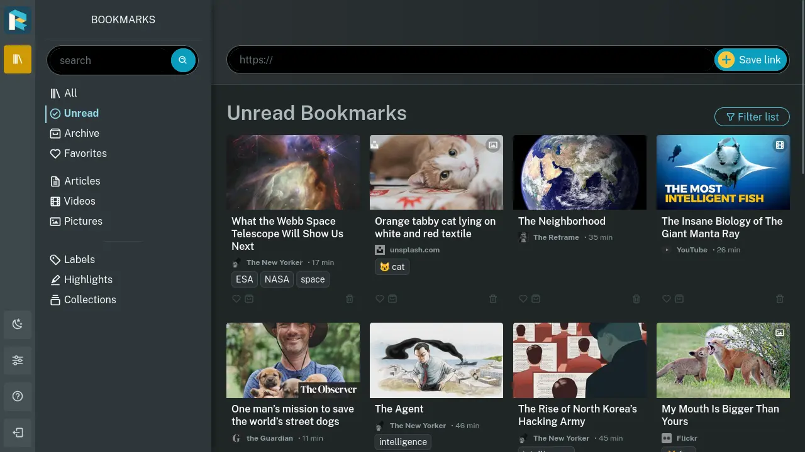

<!--
N.B.: Diese README wurde automatisch von <https://github.com/YunoHost/apps/tree/master/tools/readme_generator> generiert.
Sie darf NICHT von Hand bearbeitet werden.
-->

# Readeck für YunoHost

[](https://dash.yunohost.org/appci/app/readeck)  

[](https://install-app.yunohost.org/?app=readeck)

*[Dieses README in anderen Sprachen lesen.](./ALL_README.md)*

> *Mit diesem Paket können Sie Readeck schnell und einfach auf einem YunoHost-Server installieren.
Wenn Sie YunoHost nicht haben, lesen Sie bitte [die Anleitung](https://yunohost.org/#/install), um zu erfahren, wie Sie es installieren.*

## Übersicht

Readeck is a simple web application that lets you save the precious readable content of web pages you like and want to keep forever.
**Ausgelieferte Version:** 0.13.2~ynh1

## Bildschirmfotos



## Dokumentation und Ressourcen

- Offizielle Website der App: <https://readeck.org/>
- Offizielle Verwaltungsdokumentation: <https://readeck.org/en/docs/>
- Upstream App Repository: <https://codeberg.org/readeck/readeck>
- YunoHost-Shop: <https://apps.yunohost.org/app/readeck>
- Einen Fehler melden: <https://github.com/YunoHost-Apps/readeck_ynh/issues>

## Entwicklerinformationen

Bitte senden Sie Ihren Pull-Request an den [testing branch](https://github.com/YunoHost-Apps/readeck_ynh/tree/testing),


Um den Testing-Branch auszuprobieren, gehen Sie bitte wie folgt vor:

```bash
sudo yunohost app install https://github.com/YunoHost-Apps/readeck_ynh/tree/testing --debug
oder
sudo yunohost app upgrade readeck -u https://github.com/YunoHost-Apps/readeck_ynh/tree/testing --debug
```

**Weitere Informationen zur App-Paketierung:** <https://yunohost.org/packaging_apps>
